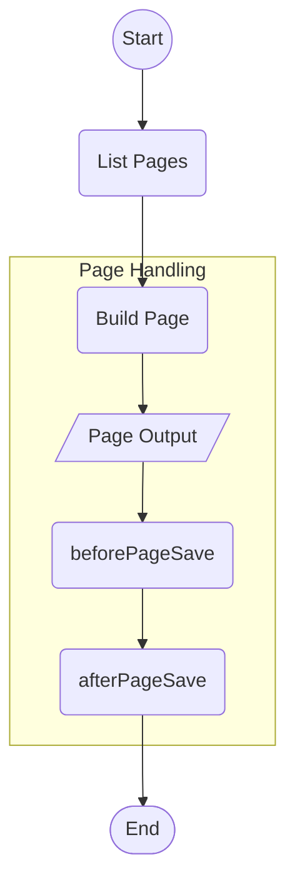
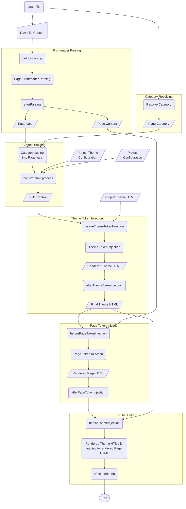

# Architecture

## Build processes

### Project build process

```mermaid
graph TD;
START@{ shape: circle, label: "Start" }
LIST_PAGES@{ shape: rounded, label: "List Pages" }
END@{ shape: stadium, label: "End" }

subgraph "Page Handling"
	BUILD_PAGE@{ shape: rounded, label: "Build Page" }
	PAGE_OUTPUT@{ shape: lean-r, label: "Page Output" }
	PH_BEFORE@{ shape: rounded, label: "beforePageSave" }
	PH_AFTER@{ shape: rounded, label: "afterPageSave" }
end

START
-->LIST_PAGES
-->BUILD_PAGE
-->PAGE_OUTPUT
-->PH_BEFORE
-->PH_AFTER
-->END
```

### Page build process

```mermaid
graph TD;
LOAD@{ shape: rounded, label: "Load File" }
RAW_FILE_CONTENT@{shape: sl-rect, label: "Raw File Content" }
THEME_HTML@{ shape: lean-r, label: "Project Theme HTML" }
THEME_CONF@{ shape: lean-r, label: "Project Theme\nConfiguration" }
PROJECT_CONF@{ shape: lean-r, label: "Project\nConfiguration" }
END@{ shape: stadium, label: "End" }

subgraph "Category Resolving"
	CATEGORY_RESOLVE@{shape: rounded, label: "Resolve Category" }
	CATEGORY_DATA@{shape: lean-r, label: "Page Category" }
end

subgraph "Frontmatter Parsing"
	FM_BEFORE@{ shape: rounded, label: "beforeParsing" }
	FM@{ shape: rounded, label: "Page Frontmatter Parsing" }
	FM_AFTER@{ shape: rounded, label: "afterParsing" }
  PAGE_DATA@{ shape: lean-r, label: "Page Vars" }
	PAGE_CONTENT@{ shape: lean-r, label: "Page Content" }
end

subgraph "Context Building"
	CATEGORY_SET@{ shape: rounded, label: "Category setting\ninto Page vars" }
	CONTEXT_BUILD@{ shape: rounded, label: "Context build process" }
	CONTEXT@{shape: lean-r, label: "Build Context" }
end

subgraph "Theme Token Injection"
	T_TI_BEFORE@{ shape: rounded, label: "beforeThemeTokenInjection" }
	T_TI@{ shape: rounded, label: "Theme Token Injection" }
	T_TI_RENDERED@{ shape: lean-r, label: "Rendered Theme HTML" }
	T_TI_AFTER@{ shape: rounded, label: "afterThemeTokenInjection" }
	T_TI_FINAL@{ shape: lean-r, label: "Final Theme HTML" }
end

subgraph "Page Token Injection"
	TI_BEFORE@{ shape: rounded, label: "beforePageTokenInjection" }
	TI@{ shape: rounded, label: "Page Token Injection" }
	TI_RENDERED@{ shape: lean-r, label: "Rendered Page HTML" }
	TI_AFTER@{ shape: rounded, label: "afterPageTokenInjection" }
end

subgraph "HTML Build"
	RE_BEFORE@{ shape: rounded, label: "beforeThemeInjection" }
  RE@{ shape: rounded, label: "Rendered Theme HTML is applied to rendered Page HTML" }
	RE_AFTER@{ shape: rounded, label: "afterRendering" }
end

LOAD-->RAW_FILE_CONTENT
LOAD-->CATEGORY_RESOLVE-->CATEGORY_DATA

RAW_FILE_CONTENT-->FM_BEFORE-->FM-->FM_AFTER

FM_AFTER-->PAGE_DATA
FM_AFTER-->PAGE_CONTENT
PAGE_DATA-->CATEGORY_SET
CATEGORY_DATA-->CATEGORY_SET

CATEGORY_SET-->CONTEXT_BUILD
THEME_CONF-->CONTEXT_BUILD
PROJECT_CONF-->CONTEXT_BUILD
-->CONTEXT


CONTEXT-->T_TI_BEFORE
THEME_HTML-->T_TI_BEFORE
-->T_TI
T_TI-->T_TI_RENDERED-->T_TI_AFTER-->T_TI_FINAL
-->TI_BEFORE

PAGE_CONTENT-->TI_BEFORE
-->TI-->TI_RENDERED-->TI_AFTER

TI_AFTER-->RE_BEFORE
T_TI_FINAL-->RE_BEFORE

RE_BEFORE-->RE-->RE_AFTER

-->END

```
